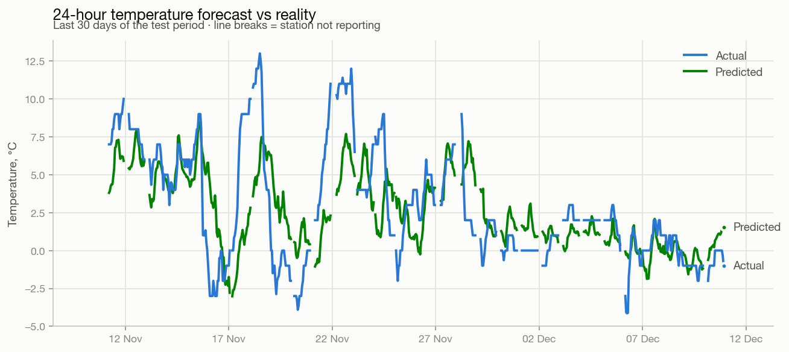
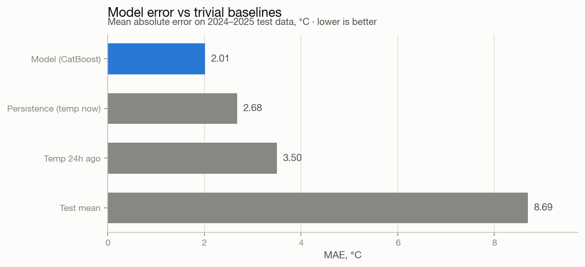
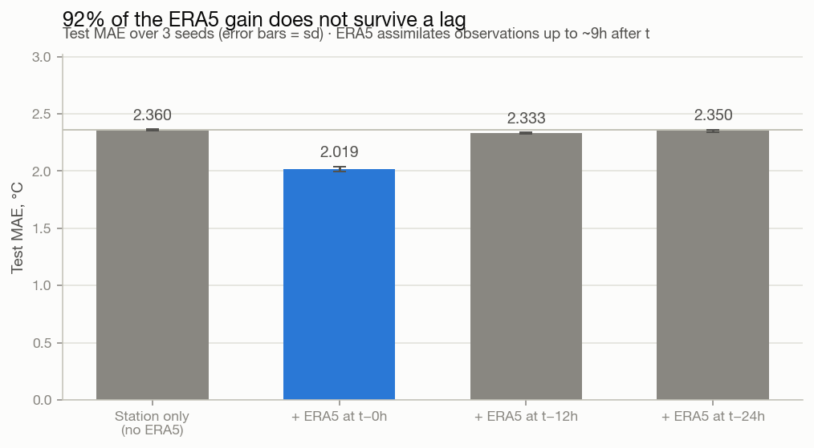
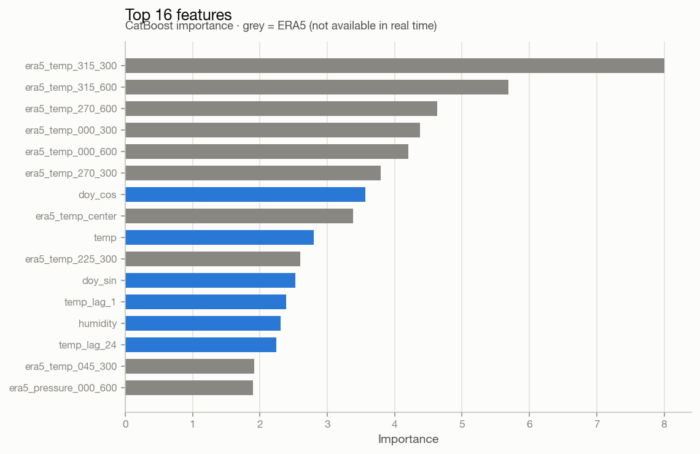
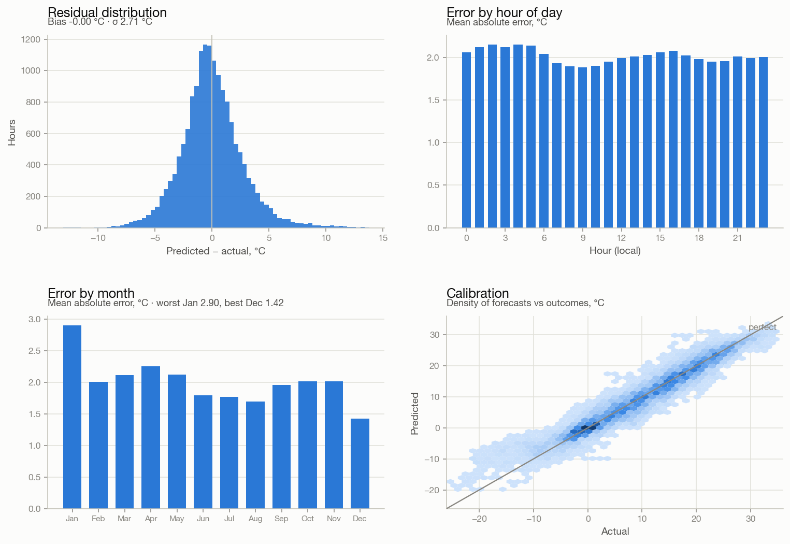

# Kursk 24-hour temperature forecast

Gradient-boosted 24-hour-ahead temperature forecasting for Kursk airport (UUOK),
trained on 13 years of RP5 METAR observations and evaluated against the trivial
baselines any weather model has to beat.

The headline number is **2.01 °C MAE** — but the more interesting result is that
**92% of that skill cannot be earned in real time**, and this README explains why.

<picture>
  <source media="(prefers-color-scheme: dark)" srcset="docs/img/actual_vs_pred-dark.png">
  
</picture>

## Results

Test period is 2024-01-01 → 2025-12-09 (16,058 hours), strictly after everything
the model saw during training.

| Forecast | MAE, °C |
|---|---|
| **CatBoost (this repo)** | **2.01** |
| Persistence — "same as right now" | 2.68 |
| "Same as 24h ago" | 3.50 |
| Test mean | 8.69 |

<picture>
  <source media="(prefers-color-scheme: dark)" srcset="docs/img/skill_vs_baselines-dark.png">
  
</picture>

Beating persistence by 25% is real but modest, and it is worth being blunt about
why: a 24-hour forecast is decided by *which air mass arrives*, and a single
station can barely see that coming.

## The honest caveat

The model is fed ERA5 reanalysis on a ring of upwind points (8 bearings × 300 and
600 km). Those features dominate the importance chart — and they are **not
usable in a live forecaster**:

- ERA5 is published with a **~5 day lag**. At real forecast time `t`, its values
  do not exist yet.
- ERA5 is assimilated in **12-hour 4D-Var windows**, so the field at time `t`
  already absorbs observations from up to **~9 hours after `t`** — part of the
  very interval being forecast.

Lagging ERA5 removes that peek. Almost all of the advantage goes with it:

<picture>
  <source media="(prefers-color-scheme: dark)" srcset="docs/img/era5_ablation-dark.png">
  
</picture>

| Configuration | MAE, °C (3 seeds) |
|---|---|
| Station only | 2.360 ± 0.006 |
| + ERA5 at `t` *(headline)* | 2.019 ± 0.021 |
| + ERA5 at `t−12h` | 2.333 ± 0.005 |
| + ERA5 at `t−24h` | 2.350 ± 0.011 |

ERA5 at `t` is worth **+0.34 MAE (57 sd)**. Lagged 12 hours it is worth
**+0.03 MAE (5 sd)** — statistically real, practically nothing. So the upwind grid
is not buying advection insight; it is buying contemporaneity.

**Read 2.36 as the deployable number and 2.01 as a research upper bound.**
`ablation.py` regenerates this table.

## What the model sees

<picture>
  <source media="(prefers-color-scheme: dark)" srcset="docs/img/feature_importance-dark.png">
  
</picture>

The top features are ERA5 temperature at 300–600 km to the **north-west and west** —
which is at least physically sensible, since that is where weather arrives from in
European Russia. Among station-only features the work is done by current
temperature, day-of-year (seasonality), and the wind vector.

Wind direction is encoded as **u/v components** (`u = −Ff·sin(az)`, `v = −Ff·cos(az)`)
rather than a raw azimuth: advection depends on direction and strength jointly, and
degrees wrap discontinuously at 0/360. The meridional component `wind_v` outranks
the zonal `wind_u`, matching the north–south temperature transport that drives this
region.

## Error structure

<picture>
  <source media="(prefers-color-scheme: dark)" srcset="docs/img/error_analysis-dark.png">
  
</picture>

Residuals are near-unbiased and roughly symmetric. Error is flat across the day and
worst in January — winter continental outbreaks are exactly the regime a
single-station model cannot anticipate.

## Data quirks worth knowing

Three things in this dataset silently corrupt a naive pipeline. All are handled in
`train_weather.py`, and all were found the hard way.

**The station sleeps at night.** Kursk airport reports ~hourly by day but goes quiet
for ~6 hours most nights (1,475 gaps of exactly 6h; hours 00–04 have ~3,400
observations against ~7,600 at midday). A plain `ffill()` onto an hourly grid
therefore *invents* a flat temperature all night and erases the nocturnal minimum —
and then the model both trains and scores on fiction. Here the grid is interpolated
in time so lags stay defined, but an `temp_observed` flag records which hours are
real, and **training and scoring use only rows measured at both feature time and
target time**.

**The UTC offset changes mid-dataset.** Kursk keeps Moscow time, which was UTC+4
until 2014-10-26 and UTC+3 after; `data.csv` is stamped local, ERA5 is UTC. Joining
them naively misaligns by 3–4 hours *with a jump in the middle*. The offsets are
verified empirically — station↔ERA5 correlation peaks at exactly −4h and −3h
(0.988 / 0.990).

**`shift(24)` is positional, not temporal.** It means "24 hours" only while the
index is a contiguous hourly grid. Drop rows before building lags and it silently
becomes "24 rows" — an arbitrary interval. Hence the ordering in `load_data`:
resample → interpolate → lag → *then* filter.

The RP5 export is also a genuinely awkward file: the whole record is wrapped in
quotes, fields are `;`-separated inside it, and the wind field may itself contain
`"Calm, no wind"`. Columns are selected by index, not header, and `QUOTE_NONE`
parsing loses only 5 of 156,493 lines.

## Setup

```bash
python -m venv .venv && source .venv/bin/activate
pip install -r requirements.txt
```

## Usage

```bash
python fetch_era5.py     # download the ERA5 upwind grid (~3 min, optional)
python train_weather.py  # train, evaluate, write artifacts/
python ablation.py       # regenerate the ERA5 honesty table (~5 min)
python plots.py          # render docs/img/ in light and dark
```

`train_weather.py` runs without `era5_grid.csv.gz` and simply trains the
station-only model. It writes `artifacts/`:

| File | Contents |
|---|---|
| `predictions.csv` | test-set actual vs predicted, stamped at **valid time** |
| `metrics.json` | MAE, baselines, split sizes, best iteration |
| `feature_importance.csv` | CatBoost importances |
| `forecast.csv` | the 24 hours past the last observation |
| `ablation.json` | ERA5 lag sweep |

Predictions are indexed by **valid time** (the hour being forecast), never by
feature time. The two differ by 24 hours, and conflating them makes a chart look
excellent while comparing the wrong hours — the daily cycle hides the shift almost
perfectly.

## Data

Not redistributed here; both sources are free to fetch yourself.

- **Station observations** — [RP5.ru](https://rp5.ru) weather archive for
  Kursk (airport), METAR format, 2012-09-26 → 2025-12-10. Export as CSV (UTF-8)
  and save as `data.csv`. Data provided by rp5.ru; their terms govern reuse.
- **ERA5 reanalysis** — fetched by `fetch_era5.py` from the
  [Open-Meteo archive API](https://open-meteo.com/) (free, no key). Generated by
  Copernicus Climate Change Service information.

## Model

CatBoost, MAE objective (matching the reported metric and robust to the outlier
days an RMSE objective chases), depth 8, lr 0.05, up to 5000 iterations with early
stopping on a held-out 2023. Splits are strictly chronological: train < 2023 ≤
validation < 2024 ≤ test.

## Limitations and next steps

The ceiling here is data, not modelling — hyperparameter tuning is worth a couple of
percent at best.

- **Use real NWP output (model output statistics).** What a numerical model
  *forecast* for `t+24` while standing at `t` is legitimately available in real time
  and is by far the strongest available feature. Open-Meteo's Historical Forecast API
  archives exactly this, back to 2021 — ~3 years of training data instead of 13, but
  almost certainly a net win.
- **Real-time neighbouring stations.** Orel, Bryansk, Voronezh, Kharkiv and others
  are 130–600 km out and available live from RP5, unlike ERA5. Coarser (3-hourly,
  gappy) but honest.
- **Longer horizons.** The pipeline is horizon-agnostic; only `HORIZON` changes.

## Licence

Code is MIT. The data is not covered by it — see **Data** above.
